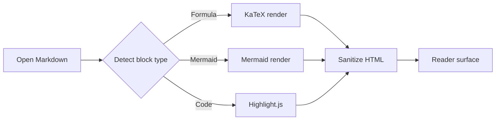
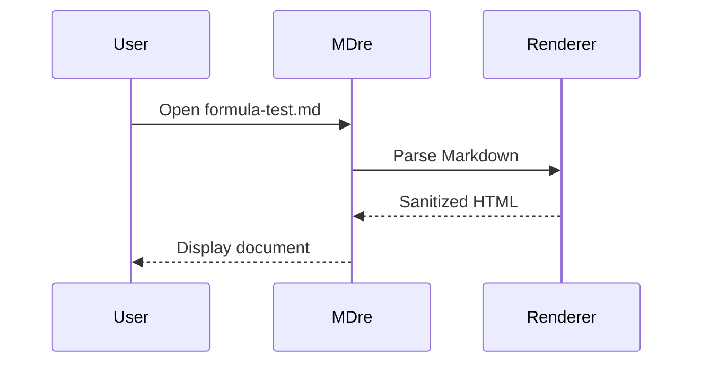

# MDre Rendering Stress Test

This file is intended to verify Markdown formula parsing, KaTeX rendering, Mermaid diagrams, code highlighting, tables, and long-document navigation.

## 1. Inline Formula Delimiters

Dollar inline formula:

$f'(x)=3x^2-3=0 \Longrightarrow x^2=1 \Longrightarrow x=1,x=-1$

Parenthesis inline formula:

\( \alpha_t = \operatorname{softmax}(q_t K^\top / \sqrt{d_k}) \)

Single-line block formula, which should not leave a stray dollar sign:

$$\min f(x)=x^3-3x$$

## 2. Bracket Display Formula

\[
\mathcal{L}(\theta)
= - \sum_{i=1}^{n} y_i \log p_\theta(x_i)
+ \lambda \lVert \theta \rVert_2^2
\]

## 3. Aligned Equations

\begin{align*}
\nabla_\theta J(\theta)
  &= \mathbb{E}_{\tau \sim \pi_\theta}
     \left[
       \sum_{t=0}^{T} \nabla_\theta \log \pi_\theta(a_t \mid s_t) R_t
     \right] \\
\operatorname{Var}(X+Y)
  &= \operatorname{Var}(X) + \operatorname{Var}(Y) + 2\operatorname{Cov}(X,Y)
\end{align*}

## 4. Cases And Piecewise Logic

\[
g(x)=
\begin{cases}
x^2, & x < 0 \\
\sin x, & 0 \le x < \pi \\
\log(1+x), & x \ge \pi
\end{cases}
\]

## 5. Matrices And Determinants

\[
A =
\begin{bmatrix}
1 & 2 & 3 \\
0 & -1 & 4 \\
5 & 2 & 0
\end{bmatrix},
\qquad
\det(A-\lambda I)=
\begin{vmatrix}
1-\lambda & 2 & 3 \\
0 & -1-\lambda & 4 \\
5 & 2 & -\lambda
\end{vmatrix}
\]

## 6. Custom Macros

\newcommand{\vect}[1]{\boldsymbol{#1}}
\newcommand{\inner}[2]{\left\langle #1,#2 \right\rangle}
\DeclareMathOperator{\rank}{rank}

The macro definition lines above should not be shown as plain text.

\[
\vect{z} = W\vect{x}+\vect{b},
\qquad
\inner{\vect{x}}{\vect{y}} = \sum_{i=1}^{n} x_i y_i,
\qquad
\rank(A) \le \min(m,n)
\]

## 7. Chemistry Formula

The following uses the KaTeX mhchem extension:

\[
\ce{CO2 + C -> 2CO}
\qquad
\ce{2H2 + O2 -> 2H2O}
\qquad
\pu{1.23e4 J mol-1}
\]

## 8. Mermaid Flowchart



## 9. Mermaid Sequence Diagram



## 10. Table And Code

| Feature | Expected Result | Notes |
| --- | --- | --- |
| `$...$` | Inline formula | No visible delimiters |
| `$$...$$` | Display formula | Single-line block must work |
| `\(...\)` | Inline formula | Common LaTeX style |
| `\[...\]` | Display formula | Common LaTeX style |
| `align*` | Multi-line display | Should align around `&` |
| `\ce{}` | Chemistry rendering | Requires mhchem |
| Mermaid | Rendered diagram | Should replace code block |

```ts
type RenderResult = {
  formulaCount: number;
  mermaidCount: number;
  hasStrayDollar: boolean;
};

const expected: RenderResult = {
  formulaCount: 9,
  mermaidCount: 2,
  hasStrayDollar: false
};
```

## 11. Long Section For Search

Search terms to verify: `softmax`, `mhchem`, `stray dollar`, `Mermaid render`, `piecewise`, `matrix`.

Repeated text for scroll testing:

1. The formula renderer should keep mathematical notation readable.
2. The formula renderer should not expose raw delimiters.
3. The formula renderer should support common academic Markdown notes.
4. The formula renderer should preserve code blocks and diagrams.
5. The formula renderer should stay usable on Android and Windows.

